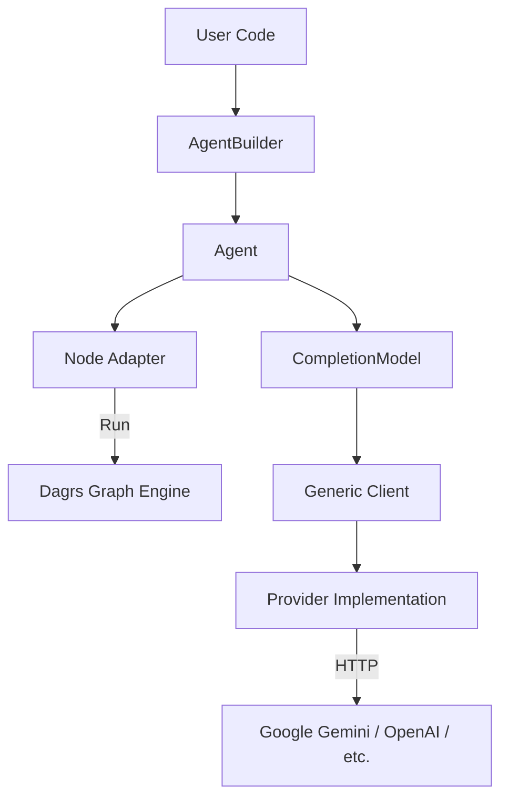

# Dagrs AI Module Architecture

This document details the architecture, file responsibilities, and usage guidelines for the native AI module introduced in `dagrs`. This module allows `dagrs` to provide lightweight, scalable AI Agent capabilities without disrupting the core logic.

## 1. Architecture Overview

The AI module is designed as an **optional Feature**, disabled by default to keep the `dagrs` core lightweight. When the `ai` feature is enabled, it provides a layered architecture that allows developers to easily integrate different Large Language Model (LLM) providers and encapsulate AI capabilities as standard DAG nodes.

### Core Design Principles
*   **Unified Interface**: Borrowing design cues from `rig-core`, it masks the differences between various LLM APIs through `Client<P>` and the `Provider` trait.
*   **Non-intrusive**: AI logic is encapsulated within the `src/ai` directory, interacting with the `dagrs` core exclusively via the `AgentAction`.
*   **Future-proof**: Data structures for Multimodal (Image), Tool calling (Tools), and RAG (Documents) are reserved, preventing interface breakage during future upgrades.

### Architecture Layer Diagram


## 2. File Responsibilities

The following key files and their responsibilities are involved in this AI module introduction:

### Core Abstraction Layer (`src/ai`)
| File Path | Responsibility Description |
| :--- | :--- |
| **`client.rs`** | Defines the generic HTTP client `Client<P>`. Handles underlying network requests, timeout controls (default 30s), and automatic system proxy configuration. |
| **`node_adapter.rs`** | Implements the `AgentAction` struct. It wraps an `Agent` into the `dagrs`'s `Action` trait, enabling it to run as a node in the graph. **Key Logic**: Automatically receives upstream input as a Prompt and broadcasts the AI response to downstream nodes. |
| **`agent/mod.rs`** | Defines the `Agent` struct and `AgentBuilder`. Manages models, system preamble, temperature parameters, and provides high-level `prompt()` and `chat()` interfaces. |
| **`completion/mod.rs`** | Defines the `CompletionModel` trait. All LLM providers must implement this interface to support text generation. |
| **`completion/message.rs`** | Defines the unified message model (`Message`, `UserContent`, `AssistantContent`). **Reserved Interfaces**: Includes `Image` and `ToolResult` variants, which currently return explicit errors if used, but are reserved for future implementation. |
| **`completion/request.rs`** | Defines the unified request structure `CompletionRequest`. Contains `tools` and `documents` fields, paving the way for future extensions. |

### Provider Implementation Layer (`src/ai/providers`)
| File Path | Responsibility Description |
| :--- | :--- |
| **`gemini/client.rs`** | Implements `GeminiProvider`. Handles Google Gemini-specific authentication logic (API Key Header). |
| **`gemini/completion.rs`** | Implements `CompletionModel` for Gemini. Converts generic `CompletionRequest` into Gemini's REST API JSON format and parses responses. **Error Handling**: Returns explicit `RequestError` for unsupported multimodal inputs. |
| **`gemini/gemini_api_types.rs`** | Defines raw JSON data structures (Serde mappings) for the Gemini API. |

### Configuration and Build
| File Path | Responsibility Description |
| :--- | :--- |
| **`Cargo.toml`** | Adds `[features] ai = ["dep:reqwest"]`. Dependencies like `reqwest` and `serde` are only introduced when AI is enabled. |
| **`BUCK`** | Synchronized updates to Buck2 build configuration ensuring correct AI module builds in a Monorepo environment. |

## 3. Usage Guide

### 3.1 Enabling AI Features
Depend on `dagrs` in your `Cargo.toml` and enable the `ai` feature:

```toml
[dependencies]
dagrs = { version = "0.6.0", features = ["ai"] }
```

### 3.2 Writing a Gemini Agent
Refer to `examples/gemini_agent.rs`:

```rust
use dagrs::ai::{agent::AgentBuilder, node_adapter::AgentAction, providers::gemini::Client};
use dagrs::{DefaultNode, Graph, NodeTable};

fn main() {
    // 1. Initialize Client
    // Requires GEMINI_API_KEY environment variable to be set
    let client = Client::from_env().expect("Failed to initialize client from env"); 
    let model = client.completion_model("gemini-1.5-flash");

    // 2. Build Agent
    let agent = AgentBuilder::new(model)
        .preamble("You are a helpful assistant.")
        .temperature(0.7)
        .build();

    // 3. Wrap as DAG Node
    let agent_action = AgentAction::new(agent);
    
    // 4. Add to Graph and Run (Standard dagrs flow)
    let mut node_table = NodeTable::new();
    let node = DefaultNode::with_action("ai_node".to_string(), agent_action, &mut node_table);
    // ... add to graph and start
}
```

### 3.3 Running Examples
```bash
# Set API Key
export GEMINI_API_KEY="your_api_key_here"

# Optional: Set proxy (useful in regions with restricted access)
export https_proxy=http://127.0.0.1:7890

# Run
cargo run --example gemini_agent --features ai
```

## 4. Key Design Decisions

1.  **Why not use existing LangChain-Rust?**
    To keep `dagrs` lightweight. Existing AI frameworks often carry heavy dependencies, whereas we only need core Agent capabilities. Implementing the `Client` layer ourselves allows for precise control over dependency size.

2.  **Network Layer Optimization**
    In `src/ai/client.rs`, we explicitly configure `reqwest::Client`:
    *   **Timeout**: 30 seconds, preventing infinite hangs during network unavailability.
    *   **Proxy**: Automatically reads system proxy environment variables, facilitating use by developers in various network environments.

3.  **Preventing Breaking Changes**
    We have predefined `Image` and `Tool` variants in the `Message` enum. Although the current version (v0.6.0) returns a "Not implemented" error when receiving images, this ensures that when multimodal support is upgraded in the future, user code structures will not need modification—only a library version upgrade will be required.
