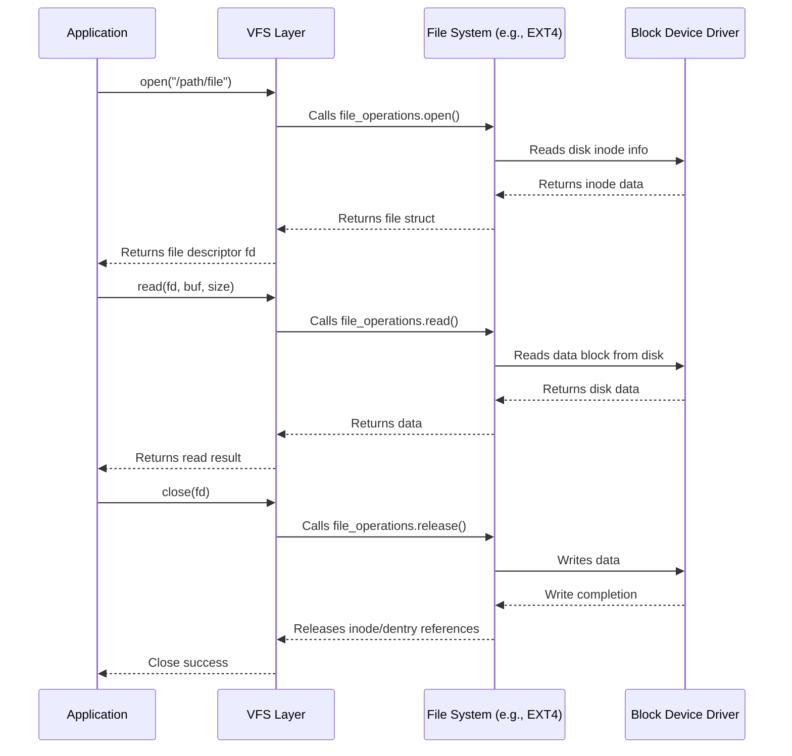
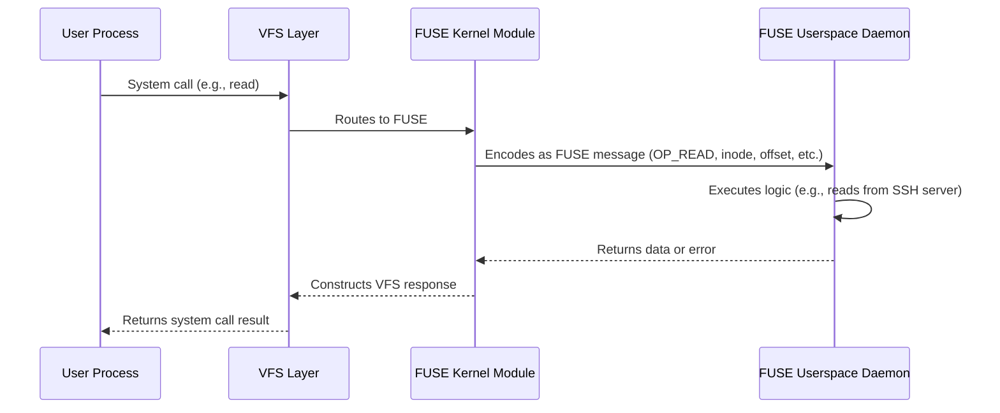
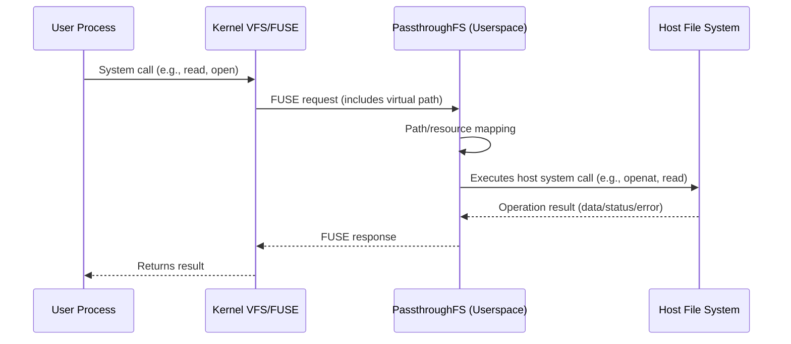
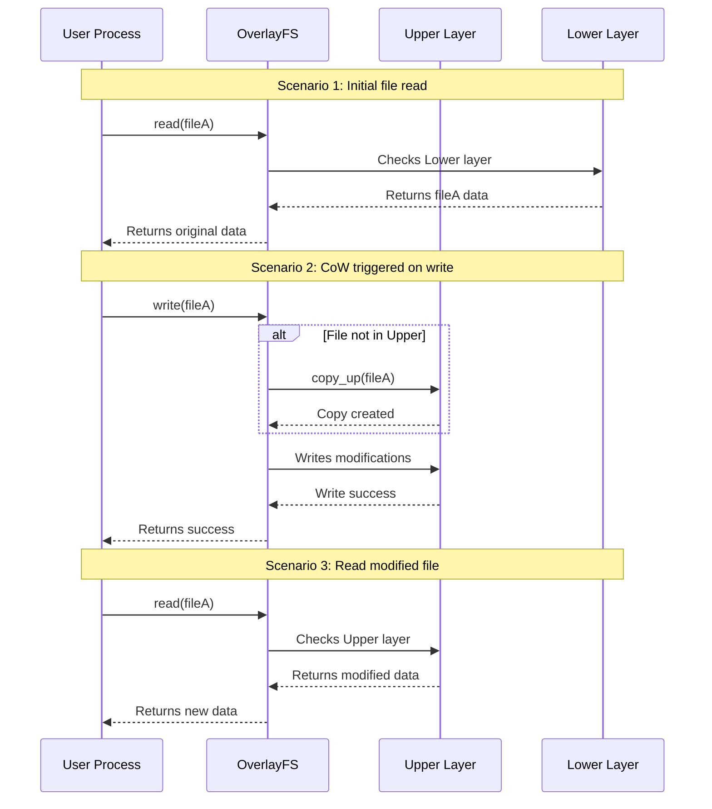

# Analysis of VFS, FUSE, Passthrough, and Overlay Mechanisms  

[TOC]  

## **1. VFS (Virtual File System)**  

VFS is an abstraction layer provided by the Linux kernel to unify access interfaces for different file systems, allowing upper-layer applications to interact without concern for the specific implementation of the underlying file system.  

---  

### **1.1 Superblock**  

The superblock stores metadata of a mounted file system, typically including:  

- **File system type** (e.g., ext4, XFS, Btrfs)  
- **Storage layout information**:  
  - Block size, total blocks, free blocks  
  - Inode count, free inodes  
- **Mount information**:  
  - Mount point, mount options (e.g., `ro`, `noatime`)  
  - Mount state (e.g., `clean` or `dirty`)  
- **File system-specific configurations** (e.g., journal size, compression options)  
- **Magic number**: Used to verify file system integrity  
- **Superblock copies**: Some file systems (e.g., ext4) store multiple copies to prevent corruption  

---  

### **1.2 Allocation Structure (Block Allocation)**  

File systems manage the allocation status of inode blocks and data blocks using the following data structures:  

- **Bitmap**:  
  - Uses 0/1 to indicate block allocation (e.g., ext4)  
  - Fast lookup but may cause fragmentation  
- **Free List**:  
  - Maintains a linked list of free blocks (e.g., FAT)  
  - Suitable for simple file systems but inefficient for random access  
- **B-Tree / B+Tree**:  
  - Modern file systems (e.g., XFS, Btrfs) use B-Trees to manage free blocks  
  - Supports efficient range queries and dynamic expansion  
- **Extent (Contiguous Allocation)**:  
  - Records the starting address and length of contiguous free blocks (e.g., ext4, NTFS)  
  - Reduces fragmentation and improves large file storage efficiency  

---  

### **1.3 Inode (Index Node)**  

Each inode represents an object (file, directory, device, etc.) in the file system and stores metadata:  

- **Basic attributes**:  
  - File type (regular file, directory, symlink, device file, etc.)  
  - Access permissions (`rwx` bits)  
  - Owner (UID/GID)  
  - File size (in bytes)  
  - Timestamps (`atime`, `mtime`, `ctime`)  
  - Hard link count (file is only deleted when this reaches zero)  
- **Dynamic inodes (modern file systems)**:  
  - Traditional file systems (e.g., ext2/ext3) have a fixed inode count  
  - Modern file systems (e.g., Btrfs, ZFS) support dynamic allocation  
- **Data block pointers**:  
  - **Direct pointers** (typically 12, pointing to data blocks)  
  - **Indirect pointers** (pointing to a block that stores more pointers)  
  - **Double indirect pointers** (pointers to pointers)  
  - **Triple indirect pointers** (supported by some file systems)  
- **Extended attributes (xattr)**:  
  - Stores additional metadata (e.g., SELinux labels, ACLs)  
- **Checksum**:  
  - Some file systems (e.g., ZFS, Btrfs) store data checksums  

---  

### **1.4 Directory Entry (Dentry)**  

A directory is a special file that maps filenames to inodes:  

- **Directory structure**:  
  - Each directory contains at least two hard links:  
    - `.` (points to itself)  
    - `..` (points to the parent directory; root's `..` points to itself)  
  - Stores mappings of `<filename, inode number>`  
- **Modern optimizations**:  
  - **Hash tables** (e.g., ext4's `htree`) for faster lookups  
  - **B-Trees** (e.g., XFS, Btrfs) for efficient insertions/deletions  
- **Directory entry cache (dcache)**:  
  - The kernel caches recently accessed dentries to speed up path resolution (e.g., `/usr/bin/ls`)  

---  

### **1.5 File Object**  

The file object (`struct file`) represents a file opened by a process:  

- **Key fields**:  
  - **Open mode** (`O_RDONLY`, `O_WRONLY`, `O_APPEND`, etc.)  
  - **Current offset** (`f_pos`, tracks read/write position)  
  - **Pointer to inode** (`f_inode`)  
  - **Reference count** (multiple processes can share the same file object)  
  - **Operation function table** (`file_operations`, e.g., `read`, `write`, `mmap`)  
  - **Private data** (extensible for file system or driver use)  
- **Relationship with file descriptor (fd)**:  
  - Each `open()` call creates a `file` object  
  - Multiple fds can point to the same `file` (e.g., `dup()` or `fork()`)  

---  

### **1.6 Workflow**  



---  

## **2. FUSE (Filesystem in Userspace)**  

FUSE is a framework that allows non-privileged users to implement file systems in userspace. By moving core file system logic from kernel space to userspace, it significantly improves development flexibility and security while reducing integration complexity with userspace services (e.g., remote storage, encryption modules).  

---  

### **2.1 Design Philosophy**  

1. **Decoupling Kernel and Userspace**  
   - File system logic runs in userspace; crashes only affect the current mount point, not the kernel.  
   - Enhanced security through permission isolation (e.g., restricting capabilities of the file system process).  
2. **Simplified Development**  
   - Developers only need to implement predefined interfaces (e.g., `open`, `read`, `write`) without kernel programming expertise.  
   - Supports dynamic loading and unloading of file systems.  

---  

### **2.2 Architecture**  

FUSE uses a layered architecture with the virtual device `/dev/fuse` for kernel-userspace communication:  

1. **Kernel Module**  
   - Intercepts VFS requests and encapsulates them into FUSE protocol messages (including operation type, parameters, etc.).  
   - Manages request priorities (e.g., interrupt handling takes precedence over regular I/O).  
   - Forwards userspace responses to the VFS layer.  
2. **Userspace Daemon**  
   - Listens to `/dev/fuse`, parses kernel requests.  
   - Executes custom file system logic (e.g., network transfers, encryption/decryption).  
   - Returns processing results (data or error codes).  

---  

### **2.3 Workflow**  



---  

### **2.4 Advantages**  

1. **Cross-Language Support**  
   Compatible with any language that can operate file descriptors (e.g., Python/Go/Rust), eliminating the need for kernel module development.  
2. **High Development Efficiency**  
   - Code modifications take effect immediately after remounting, no reboot required.  
   - Supports debugging tools (e.g., gdb, strace) for direct analysis of the file system process.  
3. **Diverse Use Cases**  

   | **Type**           | **Example**         | **Feature**                                |
   | ------------------ | ------------------- | ------------------------------------------ |
   | **Encrypted FS**   | EncFS, gocryptfs    | Transparent encryption/decryption          |
   | **Network FS**     | SSHFS, s3fs         | Maps remote storage as local path          |
   | **Virtualized FS** | OverlayFS, mergerfs | Implements union mounts or layered storage |

---  

### **2.5 Limitations**  

1. **Performance Bottlenecks**  
   - Each operation requires at least 2 context switches (userspace ↔ kernel).  
   - High data copying overhead (optimizable via `io_uring` or `splice`).  
2. **Functional Restrictions**  
   - Some VFS features require additional adaptation (e.g., `mmap` needs `page cache` interaction).  
   - Certain kernel-level optimizations are unsupported (e.g., direct I/O bypass).  
3. **Stability Risks**  
   Userspace process crashes may render the mount point unresponsive (requires daemon auto-recovery mechanisms).  

---  

## **3. PassthroughFS**  

PassthroughFS is a special virtual file system designed as a **transparent intermediary layer** that forwards ("passes through") file operations (e.g., read, write, attribute queries) from userspace or upper-layer file systems almost unmodified to an underlying host file system. It **does not store any file data or metadata** itself; its primary function is routing requests and performing necessary mapping conversions.  

---  

### **3.1 Core Features**  

- **Transparent Forwarding**: All file operations (system calls like `open`, `read`, `write`, `getattr`, `mkdir`) are directly passed to the host file system.  
- **No Storage Layer**: PassthroughFS relies entirely on the host file system for storage (no inode tables or data blocks).  
- **Path Mapping**: Converts **virtual paths** (within the mount point) to **physical paths** on the host file system.  
- **Permission and Attribute Preservation**: Retains and forwards original file attributes (permissions, UID/GID, timestamps). Permission checks are performed by the host file system.  

---  

### **3.2 Implementation**  

This project implements PassthroughFS using **FUSE (Filesystem in Userspace)**.  

When a user process initiates a file operation:  

1. The kernel VFS routes the request to the FUSE kernel module.  
2. The FUSE kernel module passes the request to the PassthroughFS daemon in userspace.  
3. PassthroughFS maps the requested path, file descriptor (fd), or inode to the target path/resource on the host file system.  
4. PassthroughFS uses standard system calls (e.g., `openat`, `read`, `write`) to access the mapped path/resource on the host file system.  
5. PassthroughFS returns the host file system's response (data, status, errors) unchanged via FUSE to the kernel and ultimately the user process.  



---  

### **3.3 Use Cases**  

1. **Container/VM File Access**  
   - **Performance**: Near-native performance (local access), far better than network-based remote file systems (e.g., NFS, CIFS).  
   - **Transparency**: Container/VM applications access host files as if they were local, without modification.  
   - **Security Isolation**: Configurable permission mapping and path conversion restrict containers/VMs to specific host directories (e.g., bind mounts).  
2. **File System Proxy & Extension**  
   - Additional functionality can be inserted during passthrough:  
     - **Logging**: Audits file operations.  
     - **Performance Analysis**: Monitors I/O latency, throughput.  
     - **Access Control**: Implements fine-grained permissions (requires mapping logic).  

---  

### **3.4 Key Technologies**  

1. **Permission Mapping (UID/GID)**  
   - **Problem**: Container/VM users (UID/GID) often reside in separate namespaces. Direct passthrough causes permission mismatches (e.g., container `root` (UID 0) may map to a regular user on the host).  
   - **Solution**: Uses **Linux User Namespace**.  
     - Specifies UID/GID mappings at mount time.  
     - PassthroughFS dynamically converts UIDs/GIDs in requests based on mapping rules (e.g., container `root` operates as UID 1000 on the host).  
2. **Path Translation**  
   - **Core**: Converts virtual paths (relative to PassthroughFS mount) to absolute host paths.  
   - **Security Measures**:  
     - **Path Traversal Protection**: Strictly checks `..` and `symlinks` to prevent escapes beyond the mount point.  
     - **Root Directory Locking**: Translated paths are confined to the host directory configured for the PassthroughFS instance.  
3. **Data & Metadata Caching**  
   - **Purpose**: Improves performance by caching host file system data (e.g., metadata, directory structures).  
   - **Cache Coherence Challenge**: Host file modifications (bypassing PassthroughFS) can invalidate caches.  
   - **Solutions**:  
     - **Kernel Mechanisms**: Uses `inotify`/`fanotify` to monitor file changes and invalidate caches.  
     - **Manual Refresh**: Configurable options or interfaces to flush caches (e.g., `attr_timeout=0` mount parameter).  
     - **Conservative Caching**: Shortens metadata cache duration (trades performance for freshness).  

---  

## **4. OverlayFS**  

OverlayFS is a union mount file system that transparently merges multiple directories ("layers") into a unified view. Its core design goal is to provide efficient layered storage and copy-on-write (CoW) functionality, making it foundational for container technologies (e.g., Docker, containerd) and useful for rapid environment setup and software testing.  

---  

### **4.1 Layered Structure**  

OverlayFS consists of an `UpperLayer` (read-write) and one or more `LowerLayers` (read-only).  

The `MergedLayer` is the unified view presented to users. Files in the `UpperLayer` shadow those in `LowerLayers`—if a file exists in the `UpperLayer`, all operations apply only to that copy.  

```mermaid  
flowchart BT  
 subgraph LL2["LowerLayer"]  
        LFileD("d.txt")  
  end  
 subgraph LL1["LowerLayer"]  
        LFileA("a.txt")  
        LFileB("b.txt")  
        LFileC("c.txt")  
  end  
 subgraph UpperLayer["UpperLayer"]  
        UFileA("a.txt")  
  end  
 subgraph MergedLayer["MergeLayer"]  
        FileA("a.txt")  
        FileB("b.txt")  
        FileC("c.txt")  
        FileD("d.txt")  
  end  
    UFileA --> FileA  
    LFileB --> FileB  
    LFileC --> FileC  
    LFileD --> FileD  

    UpperLayer --> MergedLayer  
    LL1 --> UpperLayer  
    LL2 --> LL1  
```  

---  

### **4.2 Union Mount Mechanism**  

When mounting OverlayFS, specify `LowerLayer(s)`, `UpperLayer`, and `MergedLayer`:  

- **File Lookup**: Searches `UpperLayer` first, then `LowerLayers` (top-down).  
- **Directory Merging**: If a directory exists in both `UpperLayer` and `LowerLayer`, their contents are merged in `MergedLayer`.  

---  

### **4.3 Copy-on-Write (CoW) Strategy**  

- **Reads**: Directly from the layer where the file is found (`UpperLayer` or `LowerLayer`).  
- **Writes**:  
  - Modifying a file in `LowerLayer` triggers CoW—copies the file to `UpperLayer` before modification.  
  - New files are created in `UpperLayer`.  
- **Deletions**:  
  - Deleting a file in `LowerLayer` creates a `whiteout` file (e.g., `.wh.filename`) in `UpperLayer` to hide the underlying file.  
  - Deleting a directory requires it to be empty in `MergedLayer` and marks it with an `opaque` attribute in `UpperLayer`.  



---  

### **4.4 Applications**  

1. **Container Image Layering**:  
   - **Shared Base Images**: Multiple images share read-only `LowerLayers` (e.g., `ubuntu:latest` stored once).  
   - **Incremental Builds**: Each Dockerfile instruction creates a new layer (delta from the previous layer).  
   - **Storage Efficiency**: Only unique layers consume additional space.  
   - **Fast Distribution**: Downloads only missing layers.  

2. **Container Runtime**:  
   - **Fast Startup**: Containers overlay an empty `UpperLayer` over image layers (`LowerLayers`).  
   - **Isolation**: Modifications in `UpperLayer` are container-specific.  
   - **Resource Efficiency**: Multiple containers share read-only image layers.  

3. **Sandboxing & Testing**:  
   - **Quick Setup**: Overlay a writable `UpperLayer` over a clean `LowerLayer` (base environment).  
   - **Instant Reset**: Unmounting and deleting `UpperLayer` reverts all changes.  
   - **Safe Experiments**: Protects `LowerLayer` from damage.  

---  

## **5. Comparison Summary**  

| **Feature**     | **VFS**          | **FUSE**                | **Passthrough**  | **OverlayFS**       |
| --------------- | ---------------- | ----------------------- | ---------------- | ------------------- |
| **Location**    | Kernel           | Userspace               | Kernel/Userspace | Kernel              |
| **Performance** | Optimal (native) | Poor (context switches) | Moderate         | Good (CoW overhead) |
| **Flexibility** | Low (kernel dev) | High (any logic)        | Medium           | Low (union only)    |
| **Use Cases**   | All file systems | Prototyping/Network FS  | Virtualization   | Containers/Live OS  |

---  
