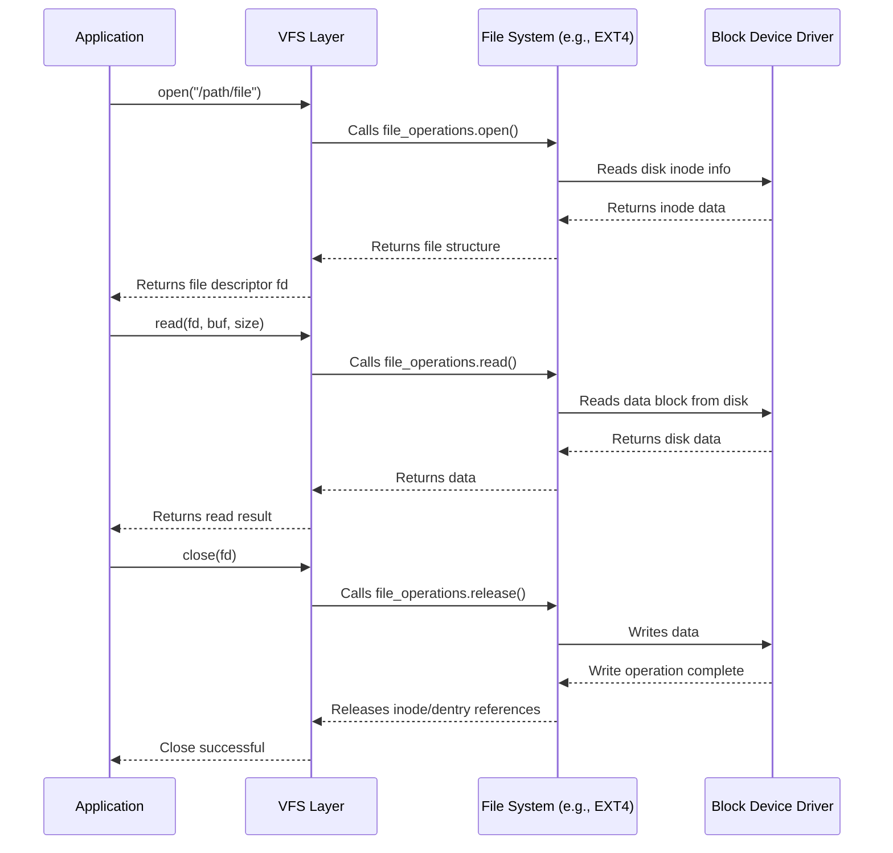
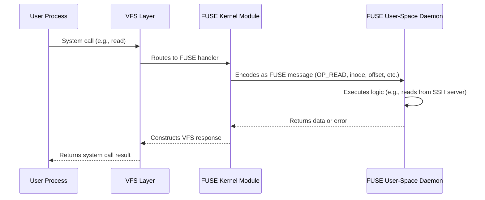
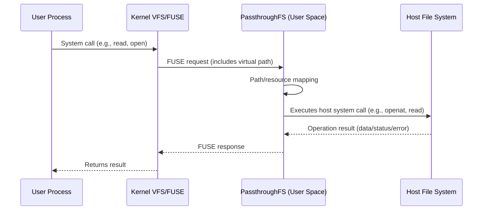
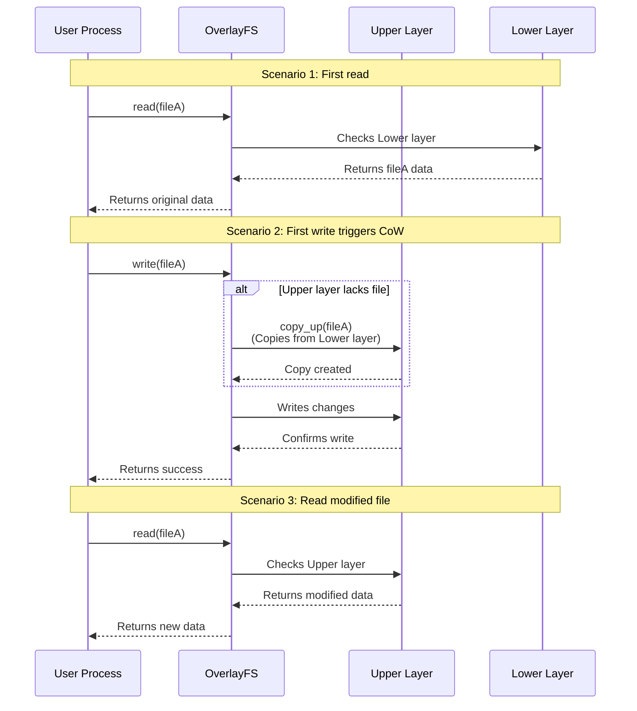

# Analysis of VFS, FUSE, Passthrough, and Overlay Mechanisms  

[TOC]  

## **1. VFS (Virtual File System)**  

VFS is an abstraction layer provided by the Linux kernel to unify access interfaces for different file systems, allowing upper-layer applications to interact without needing to understand the underlying file system implementations.  

  

---  

### **1.1 Superblock**  

The superblock stores metadata of a mounted file system, typically including:  

- **File system type** (e.g., ext4, XFS, Btrfs)  
- **Storage layout information**:  
  - Block size, total blocks, free blocks  
  - Inode count, free inode count  
- **Mount information**:  
  - Mount point, mount options (e.g., `ro`, `noatime`)  
  - Mount state (e.g., `clean` or `dirty`)  
- **File system-specific configurations** (e.g., journal size, compression options)  

---  

### **1.2 Allocation Structure (Block Allocation)**  

File systems need to manage the allocation status of inode blocks and data blocks. Common data structures include:  

- **Bitmap**:  
  - Uses 0/1 to indicate block allocation status (e.g., ext4)  
  - Fast lookup but may cause fragmentation  
- **Free List**:  
  - Maintains a linked list of free blocks (e.g., FAT)  
  - Suitable for simple file systems but inefficient for random access  
- **B-Tree / B+Tree**:  
  - Used by modern file systems (e.g., XFS, Btrfs) to manage free blocks  
  - Supports efficient range queries and dynamic expansion  
- **Extent (Contiguous Allocation)**:  
  - Records the starting address and length of contiguous free blocks (e.g., ext4, NTFS)  
  - Reduces fragmentation and improves large file storage efficiency  

---  

### **1.3 inode (Index Node)**  

Each inode represents an object (file, directory, device, etc.) in the file system and stores metadata such as:  

- **Basic attributes**:  
  - File type (regular file, directory, symbolic link, device file, etc.)  
  - Access permissions (`rwx` bits)  
  - Owner (UID/GID)  
  - File size (in bytes)  
  - Timestamps (`atime`, `mtime`, `ctime`)  
  - Hard link count (file is only deleted when this reaches zero)  
- **Dynamic inodes (modern file systems)**:  
  - Traditional file systems (e.g., ext2/ext3) have a fixed inode count  
  - Modern file systems (e.g., Btrfs, ZFS) support dynamic allocation  
- **Data block pointers**:  
  - **Direct pointers** (typically 12, pointing to data blocks)  
  - **Indirect pointers** (pointing to a block that stores more pointers)  
  - **Double indirect pointers** (pointers to pointers)  
  - **Triple indirect pointers** (supported by some file systems)  
- **Extended attributes (xattr)**:  
  - Stores additional metadata (e.g., SELinux labels, ACLs)  

---  

### **1.4 Directory Entry (Dentry)**  

A directory is a special file that maps filenames to inodes:  

- **Directory structure**:  
  - Each directory contains at least two hard links:  
    - `.` (points to itself)  
    - `..` (points to the parent directory; root's `..` points to itself)  
  - Stores mappings of `<filename, inode number>`  
- **Modern optimizations**:  
  - **Hash tables** (e.g., ext4's `htree`) speed up lookups  
  - **B-Trees** (e.g., XFS, Btrfs) support efficient insertions/deletions  

---  

### **1.5 File Object**  

The file object (`struct file`) represents a file opened by a process:  

- **Key fields**:  
  - **Open mode** (`O_RDONLY`, `O_WRONLY`, `O_APPEND`, etc.)  
  - **Current offset** (`f_pos`, tracks read/write position)  
  - **Pointer to inode** (`f_inode`)  
  - **Reference count** (multiple processes can share the same file object)  
  - **Operation function table** (`file_operations`, e.g., `read`, `write`, `mmap`)  
  - **Private data** (extensible for file system or driver use)  
- **Relationship with file descriptors (fd)**:  
  - Each `open()` call creates a `file` object  
  - Multiple fds can point to the same `file` (e.g., `dup()` or `fork()`)  

---  

### **1.6 Workflow**  



---  

## **2. FUSE (Filesystem in Userspace)**  

FUSE is a framework that allows non-privileged users to implement file systems in user space. By moving core file system logic from kernel space to user space, it significantly improves development flexibility and security while reducing integration complexity with user-space services (e.g., remote storage, encryption modules).  

---  

### **2.1 Design Philosophy**  

1. **Decoupling Kernel and User Space**  
   - File system logic runs in user space; crashes only affect the current mount point, not the kernel.  
   - Enhances security through permission isolation (e.g., restricting file system process capabilities).  
2. **Simplified Development Paradigm**  
   - Developers only need to implement predefined interfaces (e.g., `open`, `read`, `write`) without kernel programming expertise.  
   - Supports dynamic loading and unloading of file systems.  

---  

### **2.2 Architecture**  

FUSE uses a layered architecture, communicating between the kernel and user space via the virtual device `/dev/fuse`:  

1. **Kernel Module**  
   - Intercepts VFS requests and encapsulates them into FUSE protocol messages (including operation type, parameters, etc.).  
   - Manages request priorities (e.g., interrupt handling takes precedence over regular I/O).  
   - Forwards user-space responses to the VFS layer.  
2. **User-Space Daemon**  
   - Listens to `/dev/fuse`, parses kernel requests.  
   - Executes custom file system logic (e.g., network transmission, encryption/decryption).  
   - Returns processing results (data or error codes).  

  

---  

### **2.3 Workflow**  



---  

### **2.4 Advantages**  

1. **Cross-Language Support**  
   Compatible with any language that can manipulate file descriptors (e.g., Python/Go/Rust), eliminating the need for kernel module development.  
2. **High Development Efficiency**  
   - Code modifications take effect immediately upon remounting, no system restart required.  
   - Supports debugging tools (e.g., gdb, strace) for direct analysis of file system processes.  
3. **Diverse Use Cases**  

   | **Type**             | **Examples**         | **Features**                     |  
   | -------------------- | -------------------- | -------------------------------- |  
   | **Encrypted FS**     | EncFS, gocryptfs     | Transparent user-space encryption |  
   | **Network FS**       | SSHFS, s3fs          | Maps remote storage as local path |  
   | **Virtualized Storage** | OverlayFS, mergerfs | Implements union mounts or layered storage |  

---  

### **2.5 Limitations**  

1. **Performance Bottlenecks**  
   - Each operation requires at least 2 context switches (user ↔ kernel space).  
   - High data copy overhead (optimizable via `io_uring` or `splice`).  
2. **Functional Constraints**  
   - Some VFS features require additional adaptation (e.g., `mmap` needs `page cache` interaction).  
   - Certain kernel-level optimizations are unsupported (e.g., direct I/O bypass).  
3. **Stability Risks**  
   User-space process crashes may render the mount point unresponsive (requires daemon auto-recovery mechanisms).  

---  

## **3. PassthroughFS**  

PassthroughFS is a special type of virtual file system designed to act as a **transparent intermediary layer**, forwarding file operation requests (e.g., read, write, attribute queries) from user space or upper-layer file systems almost unmodified ("passthrough") to an underlying host file system. It **does not store any file data or metadata** itself; its primary function is routing requests and performing necessary mapping conversions.  

---  

### **3.1 Core Features**  

- **Transparent Forwarding**: All file operations (system calls like `open`, `read`, `write`, `getattr`, `mkdir`) are directly passed to the host file system.  
- **No Storage Layer**: PassthroughFS relies entirely on the underlying host file system for storage.  
- **Path Mapping**: Converts **virtual paths** (within the mount point) to **physical paths** on the host file system.  
- **Permission & Attribute Passing**: Preserves and forwards original file attributes (permissions, ownership, timestamps). Permission checks are handled by the host file system.  

---  

### **3.2 Implementation**  

This project implements PassthroughFS based on the **FUSE (Filesystem in Userspace)** framework.  

When a user process initiates a file system operation:  

1. The kernel VFS layer routes the request to the FUSE kernel module.  
2. The FUSE kernel module passes the request to the PassthroughFS daemon in user space.  
3. PassthroughFS maps the request's path, file descriptor (fd), or inode information to the target path/resource identifier on the host file system.  
4. PassthroughFS uses standard system calls (e.g., `openat`, `read`, `write`) to **directly access** the mapped path/resource on the host file system.  
5. PassthroughFS returns the host file system's response (data, status code, error) **unchanged** to the kernel via FUSE, ultimately reaching the user process.  



---  

### **3.3 Use Cases**  

1. **Container/VM File Access Passthrough**  
   - **Performance**: Near-native file system performance (locally), far better than network-based remote file systems (e.g., NFS, CIFS).  
   - **Transparent Access**: Container/VM applications can access host files as if they were local, without modification.  
   - **Security Isolation**: Precise permission mapping and path conversion rules restrict containers/VMs to specific host directories (e.g., bind mounts).  
2. **File System Proxy & Extension**  
   - Acts as a proxy layer for underlying file systems, enabling additional features during passthrough:  
     - **Logging**: Audits file operations.  
     - **Performance Analysis**: Monitors I/O latency, throughput.  
     - **Access Control**: Implements finer-grained permission policies (requires mapping logic).  

---  

### **3.4 Key Technologies**  

1. **Permission Mapping (UID/GID Mapping)**  
   - **Issue**: Container/VM users (UID/GID) and host users (UID/GID) often reside in separate namespaces. Direct passthrough causes permission mismatches (e.g., container `root` (UID 0) may map to a regular host user).  
   - **Solution**: Uses **Linux User Namespace**.  
     - Specifies UID/GID mappings during PassthroughFS mount.  
     - PassthroughFS dynamically converts UIDs/GIDs in requests based on mapping rules before forwarding to the host.  
2. **Path Translation**  
   - **Core**: Converts virtual paths (relative to PassthroughFS mount point) to absolute paths on the host file system.  
   - **Security Measures**:  
     - **Path Traversal Protection**: Strictly checks and handles `..` (parent directory) and `symlinks` to prevent container apps from accessing unauthorized host paths.  
     - **Root Directory Locking**: Translated paths must be confined to predefined host directories.  

---  

## **4. OverlayFS**  

`OverlayFS` is a union mount file system that transparently merges multiple directories (layers) into a unified view. Its core design goal is to provide efficient layered storage and copy-on-write functionality, making it foundational for container technologies (e.g., Docker, containerd) and useful for rapid environment setup and software testing.  

---  

### **4.1 Layered Structure**  

`OverlayFS` consists of an `UpperLayer` and one or more `LowerLayers`. The `UpperLayer` must be read-write, while `LowerLayers` are read-only.  

The `MergedLayer` is the final view presented to users. It combines the `UpperLayer` and `LowerLayers`, with the upper layer shadowing the lower layers. If a file exists in the upper layer, all operations apply only to that version.  

```mermaid  
flowchart BT  
 subgraph LL2["LowerLayer"]  
        LFileD("d.txt")  
  end  
 subgraph LL1["LowerLayer"]  
        LFileA("a.txt")  
        LFileB("b.txt")  
        LFileC("c.txt")  
  end  
 subgraph UpperLayer["UpperLayer"]  
        UFileA("a.txt")  
  end  
 subgraph MergedLayer["MergeLayer"]  
        FileA("a.txt")  
        FileB("b.txt")  
        FileC("c.txt")  
        FileD("d.txt")  
  end  
    UFileA --> FileA  
    LFileB --> FileB  
    LFileC --> FileC  
    LFileD --> FileD  

    UpperLayer --> MergedLayer  
    LL1 --> UpperLayer  
    LL2 --> LL1  
```  

---  

### **4.2 Union Mount Mechanism**  

When mounting `OverlayFS`, the `LowerLayer(s)`, `UpperLayer`, and `MergedLayer` must be specified.  

`OverlayFS` handles file access in the `MergedLayer` by searching and combining files from the `LowerLayer(s)` and `UpperLayer` according to specific rules:  

- **File Lookup**: When searching for a file/directory in the `MergedLayer`, the `UpperLayer` is checked first. If not found, the search proceeds down the `LowerLayer(s)` (from topmost to bottom).  

---  

### **4.3 Copy-on-Write (CoW) Strategy**  

- **Reads**: Files are read directly from their respective layers (`UpperLayer` or a `LowerLayer`) with no additional overhead.  
- **Writes**: Modifying a file that exists in a `LowerLayer` but not the `UpperLayer` triggers a CoW operation—OverlayFS first copies the file from the `LowerLayer` to the `UpperLayer` before applying changes. Subsequent operations use the `UpperLayer` copy.  



---  

### **4.4 Applications**  

1. **Container Image Layering**:  
   - **Shared Base Images**: Docker images consist of multiple read-only layers (`LowerLayers`). A base image (e.g., `ubuntu:latest`) can be shared by countless derived images, stored only once physically.  
   - **Incremental Builds**: Each Dockerfile instruction (e.g., `RUN`, `COPY`) typically generates a new read-only layer containing only changes from the previous layer.  
   - **Storage Efficiency**: Different container images share identical base and intermediate layers, reducing redundancy.  
   - **Fast Distribution**: Only missing layers need downloading.  

2. **Container Runtime**:  
   - **Fast Startup**: Containers overlay a new, empty `UpperLayer` (writable) over image layers (`LowerLayers`), avoiding full image copies.  
   - **Isolation**: Each container's `UpperLayer` isolates its changes from other containers sharing the same image layers.  

3. **Sandboxing & Testing**:  
   - **Quick Environment Setup**: Overlay a writable `UpperLayer` over a clean base (`LowerLayer`) for experiments.  
   - **Instant Reset**: Unmounting OverlayFS and deleting the `UpperLayer` reverts all changes, restoring the pristine `LowerLayer`.  

---  

## **5. Comparison Summary**  

| **Feature**   | **VFS**          | **FUSE**               | **Passthrough**    | **OverlayFS**    |  
| ------------ | ---------------- | ---------------------- | ------------------ | ---------------- |  
| **Location** | Kernel           | User Space             | Kernel/User Hybrid | Kernel           |  
| **Performance** | Optimal (native) | Poor (context switches) | Moderate           | Good (CoW overhead) |  
| **Flexibility** | Low (kernel dev) | High (any user logic)  | Medium             | Low (dir merging) |  
| **Use Cases** | All file systems | Prototyping/Network FS | Virtualization     | Containers       |  

### General File System Properties  

1. `rename` is atomic.  
2. Hard links retain the same inode number.  
3. One inode can map to multiple filenames.  
4. Hard links can only be created within the same file system.  
5. Creating a hard link increments the inode's link count.  
6. **Only when** the link count reaches zero is the file deleted.  
7. Inodes are unique within the same file system.  
8. `rename`/`mv` does not change inode numbers.  
9. Empty directories have two hard links:  
   - `.` points to itself.  
   - `..` points to the parent directory.  
10. Each subdirectory creates a `..` hard link to its parent.  
11. `rm` decrements the inode's link count; inodes and data blocks are marked free only when **the link count is zero**.
