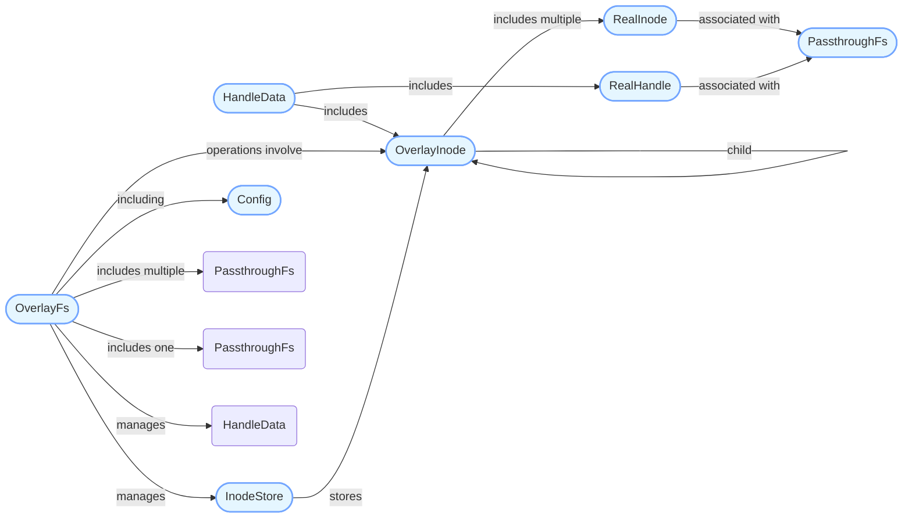

```mermaid
graph LR
    classDef process fill:#E5F6FF,stroke:#73A6FF,stroke-width:2px

    OverlayFs([OverlayFs]):::process
    OverlayInode([OverlayInode]):::process
    RealInode([RealInode]):::process
    RealHandle([RealHandle]):::process
    HandleData([HandleData]):::process
    InodeStore([InodeStore]):::process
    Config([Config]):::process
    PassthroughFs([PassthroughFs]):::process

    OverlayFs -->|including| Config
    OverlayFs -->|includes multiple| lower_layers(PassthroughFs)
    OverlayFs -->|includes one| upper_layer(PassthroughFs)
    OverlayFs -->|manages| InodeStore
    OverlayFs -->|manages| handles(HandleData)

    OverlayInode -->|includes multiple| RealInode
    OverlayInode -->|parent| OverlayInode
    OverlayInode -->|child| OverlayInode

    RealInode -->|associated with| PassthroughFs
    RealHandle -->|associated with| PassthroughFs
    HandleData -->|includes| OverlayInode
    HandleData -->|includes| RealHandle

    OverlayFs -->|operations involve| OverlayInode
    InodeStore -->|stores| OverlayInode

```