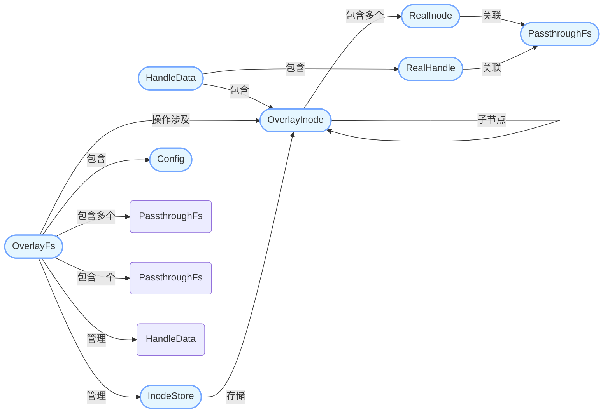

```mermaid
graph LR
    classDef process fill:#E5F6FF,stroke:#73A6FF,stroke-width:2px
    
    OverlayFs([OverlayFs]):::process
    OverlayInode([OverlayInode]):::process
    RealInode([RealInode]):::process
    RealHandle([RealHandle]):::process
    HandleData([HandleData]):::process
    InodeStore([InodeStore]):::process
    Config([Config]):::process
    PassthroughFs([PassthroughFs]):::process
    
    OverlayFs -->|包含| Config
    OverlayFs -->|包含多个| lower_layers(PassthroughFs)
    OverlayFs -->|包含一个| upper_layer(PassthroughFs)
    OverlayFs -->|管理| InodeStore
    OverlayFs -->|管理| handles(HandleData)
    
    OverlayInode -->|包含多个| RealInode
    OverlayInode -->|父节点| OverlayInode
    OverlayInode -->|子节点| OverlayInode
    
    RealInode -->|关联| PassthroughFs
    RealHandle -->|关联| PassthroughFs
    HandleData -->|包含| OverlayInode
    HandleData -->|包含| RealHandle
    
    OverlayFs -->|操作涉及| OverlayInode
    InodeStore -->|存储| OverlayInode

```