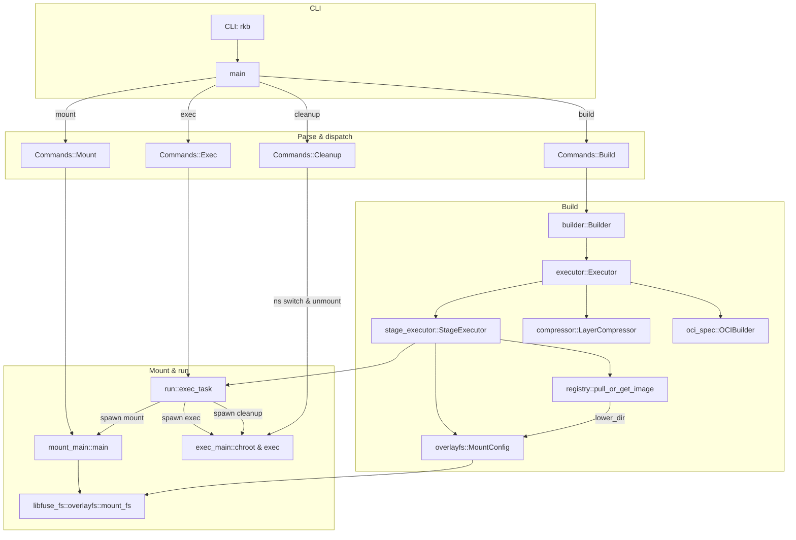

# rkb

An implementation of `docker build` in Rust.

## Architecture



## Quick Start

The following operations are based on Ubuntu 24.04.


### Build simple image

Build rkb from source code.

```sh
cargo build
```

Create a sample Dockerfile named `example-Dockerfile` in the current working directory with the following content:

```Dockerfile
# syntax=docker/dockerfile:1
FROM ubuntu:latest AS base

# install app dependencies
RUN apt-get update && apt-get install -y python3 python3-pip

# install app
COPY hello.py /

CMD ["python3", "/hello.py"]
```

Create a `hello.py` file in the current working directory with the following content:

```python
print("hello")
```

Create a directory to store the output image.

```sh
mkdir -p output
```

Start rkb (root privilege is required).

```sh
sudo ../target/debug/rkb -f example-Dockerfile -t image1 -o output
```

### Example result

The output is as follows:

```sh
output
└── image1
    ├── blobs
    │   └── sha256
    │       ├── 03dfba9894466397011a00b09fcbc9b7abb3a57d85db2421940c4e624762fe7d
    │       ├── 35692eaefdd52eda99caddb2512a29e5a71d8d0026a9e333fa13cc6154537c72
    │       ├── 63de00b83394b3709ddcdaa3dfa25271b1c1ef430b78c1d42ec08944e4a30841
    │       ├── 875ca7be9612ab1b3da46fa06d869a717c69ac4d25a61f69a64beae4ae04e0f8
    │       └── 9e020b213b8cc38975cc58e11f16ddd8c6ecb0f2c2cc23c49fd83040a4bd5924
    ├── index.json
    └── oci-layout
```

The content of `index.json` is as follows:

```json
{
  "schemaVersion": 2,
  "mediaType": "application/vnd.oci.image.index.v1+json",
  "manifests": [
    {
      "mediaType": "application/vnd.oci.image.manifest.v1+json",
      "digest": "sha256:03dfba9894466397011a00b09fcbc9b7abb3a57d85db2421940c4e624762fe7d",
      "size": 863,
      "annotations": {
        "org.opencontainers.image.ref.name": "latest"
      }
    }
  ]
}
```

The contents of `manifest.json` are as follows:

```json
{
  "schemaVersion": 2,
  "mediaType": "application/vnd.oci.image.manifest.v1+json",
  "config": {
    "mediaType": "application/vnd.oci.image.config.v1+json",
    "digest": "sha256:9e020b213b8cc38975cc58e11f16ddd8c6ecb0f2c2cc23c49fd83040a4bd5924",
    "size": 495
  },
  "layers": [
    {
      "mediaType": "application/vnd.oci.image.layer.v1.tar+gzip",
      "digest": "sha256:63de00b83394b3709ddcdaa3dfa25271b1c1ef430b78c1d42ec08944e4a30841",
      "size": 31670206
    },
    {
      "mediaType": "application/vnd.oci.image.layer.v1.tar+gzip",
      "digest": "sha256:35692eaefdd52eda99caddb2512a29e5a71d8d0026a9e333fa13cc6154537c72",
      "size": 186652785
    },
    {
      "mediaType": "application/vnd.oci.image.layer.v1.tar+gzip",
      "digest": "sha256:875ca7be9612ab1b3da46fa06d869a717c69ac4d25a61f69a64beae4ae04e0f8",
      "size": 113
    }
  ]
}
```

The content of `config.json` is as follows:

```json
{
  "created": "2025-04-11T09:00:23.606751022+00:00",
  "architecture": "amd64",
  "os": "linux",
  "config": {
    "Cmd": [
      "python3",
      "/hello.py"
    ]
  },
  "rootfs": {
    "type": "layers",
    "diff_ids": [
      "sha256:04e09a21ee0654934fc32468da7221263a536d95d2e8d446510598a649ce9f3f",
      "sha256:df687f165b82847b72b50ad5dec22912c1608a2f0b0cd1e7b8c54622272e504b",
      "sha256:ba5b6c51e01b1b09ba60bbee0b4bd267a96ba162d8ad0d5059428338702784c7"
    ]
  },
  "history": []
}
```

### Convert image to bundle

Use umoci to convert the image into a bundle.

First, verify the tag of `image1`.

```sh
❯ cd output && umoci ls --layout image1
latest
```

Then, convert `image1` into an OCI bundle.

```sh
sudo umoci unpack --image image1:latest bundle
```

## rkb usage

```sh
Usage: rkb [OPTIONS]

Options:
  -f, --file <FILE>       Dockerfile or Containerfile
  -t, --tag <IMAGE NAME>  Name of the resulting image
  -o, --output-dir <DIR>  Output directory for the image
  -h, --help              Print help
```

## TODOs

### Supported features

| Feature         | Status |
|-----------------|--------|
| lib-fuse        | ✅     |
| Cross-platform  | ❌     |

### Supported Dockerfile instructions

| Instruction | Status |
|-------------|--------|
| FROM        | ✅     |
| RUN         | ✅     |
| CMD         | ✅     |
| ENV         | ✅     |
| LABEL       | ✅     |
| COPY        | ✅     |
| ENTRYPOINT  | ✅     |
| ARG         | ❌     |