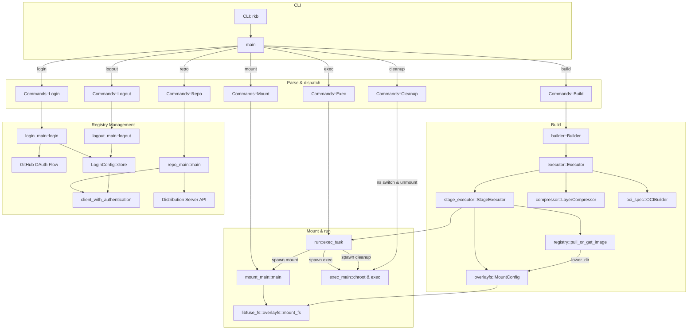

# rkb

A container image builder and registry management tool implemented in Rust, similar to `docker build` functionality with additional support for interacting with distribution servers.

## Architecture



## Quick Start

The following operations are based on Ubuntu 24.04.


### Build simple image

Build rkb from source code.

```sh
cargo build
```

Create a sample Dockerfile named `example-Dockerfile` in the current working directory with the following content:

```Dockerfile
# syntax=docker/dockerfile:1
FROM ubuntu:latest AS base

# install app dependencies
RUN apt-get update && apt-get install -y python3 python3-pip

# install app
COPY hello.py /

CMD ["python3", "/hello.py"]
```

Create a `hello.py` file in the current working directory with the following content:

```python
print("hello")
```

Create a directory to store the output image.

```sh
mkdir -p output
```

Start rkb (root privilege is required).

```sh
sudo ../target/debug/rkb build -f example-Dockerfile -t image1 -o output
```

### Example result

The output is as follows:

```sh
output
└── image1
    ├── blobs
    │   └── sha256
    │       ├── 03dfba9894466397011a00b09fcbc9b7abb3a57d85db2421940c4e624762fe7d
    │       ├── 35692eaefdd52eda99caddb2512a29e5a71d8d0026a9e333fa13cc6154537c72
    │       ├── 63de00b83394b3709ddcdaa3dfa25271b1c1ef430b78c1d42ec08944e4a30841
    │       ├── 875ca7be9612ab1b3da46fa06d869a717c69ac4d25a61f69a64beae4ae04e0f8
    │       └── 9e020b213b8cc38975cc58e11f16ddd8c6ecb0f2c2cc23c49fd83040a4bd5924
    ├── index.json
    └── oci-layout
```

The content of `index.json` is as follows:

```json
{
  "schemaVersion": 2,
  "mediaType": "application/vnd.oci.image.index.v1+json",
  "manifests": [
    {
      "mediaType": "application/vnd.oci.image.manifest.v1+json",
      "digest": "sha256:03dfba9894466397011a00b09fcbc9b7abb3a57d85db2421940c4e624762fe7d",
      "size": 863,
      "annotations": {
        "org.opencontainers.image.ref.name": "latest"
      }
    }
  ]
}
```

The contents of `manifest.json` are as follows:

```json
{
  "schemaVersion": 2,
  "mediaType": "application/vnd.oci.image.manifest.v1+json",
  "config": {
    "mediaType": "application/vnd.oci.image.config.v1+json",
    "digest": "sha256:9e020b213b8cc38975cc58e11f16ddd8c6ecb0f2c2cc23c49fd83040a4bd5924",
    "size": 495
  },
  "layers": [
    {
      "mediaType": "application/vnd.oci.image.layer.v1.tar+gzip",
      "digest": "sha256:63de00b83394b3709ddcdaa3dfa25271b1c1ef430b78c1d42ec08944e4a30841",
      "size": 31670206
    },
    {
      "mediaType": "application/vnd.oci.image.layer.v1.tar+gzip",
      "digest": "sha256:35692eaefdd52eda99caddb2512a29e5a71d8d0026a9e333fa13cc6154537c72",
      "size": 186652785
    },
    {
      "mediaType": "application/vnd.oci.image.layer.v1.tar+gzip",
      "digest": "sha256:875ca7be9612ab1b3da46fa06d869a717c69ac4d25a61f69a64beae4ae04e0f8",
      "size": 113
    }
  ]
}
```

The content of `config.json` is as follows:

```json
{
  "created": "2025-04-11T09:00:23.606751022+00:00",
  "architecture": "amd64",
  "os": "linux",
  "config": {
    "Cmd": [
      "python3",
      "/hello.py"
    ]
  },
  "rootfs": {
    "type": "layers",
    "diff_ids": [
      "sha256:04e09a21ee0654934fc32468da7221263a536d95d2e8d446510598a649ce9f3f",
      "sha256:df687f165b82847b72b50ad5dec22912c1608a2f0b0cd1e7b8c54622272e504b",
      "sha256:ba5b6c51e01b1b09ba60bbee0b4bd267a96ba162d8ad0d5059428338702784c7"
    ]
  },
  "history": []
}
```

### Convert image to bundle

Use umoci to convert the image into a bundle.

First, verify the tag of `image1`.

```sh
❯ cd output && umoci ls --layout image1
latest
```

Then, convert `image1` into an OCI bundle.

```sh
sudo umoci unpack --image image1:latest bundle
```

## Registry Management

### Login to Distribution Server

First, login to your distribution server using GitHub OAuth:

```sh
# First time login (both URL and client ID required)
rkb login https://your-distribution-server.com your-github-oauth-client-id

# Re-login when PAT expires (client ID will be reused from config)
rkb login https://your-distribution-server.com

# If only one server is configured, you can omit the URL too
rkb login
```

This will open a browser for GitHub OAuth authentication and store the credentials locally. The client ID is required only for the first login to a server - it will be saved and reused for subsequent logins. If you have only one server configured, you can omit both URL and client ID for re-login.

### List Repositories

List all repositories on the distribution server:

```sh
rkb repo list
```

Or specify a server URL if you have multiple servers configured:

```sh
rkb repo --url https://your-distribution-server.com list
```

### Manage Repository Visibility

Change repository visibility between public and private. Note that the repository name must be the full name including namespace:

```sh
rkb repo vis mine/hello-world public
rkb repo vis mine/hello-world private
```

Or with a specific server:

```sh
rkb repo --url https://your-distribution-server.com vis mine/hello-world public
```

### Logout

Logout from the distribution server:

```sh
rkb logout
```

Or logout from a specific server:

```sh
rkb logout https://your-distribution-server.com
```

## rkb usage

```sh
Usage: rkb <COMMAND>

Commands:
  build   Build a container image from Dockerfile
  login   Login to distribution server
  logout  Logout from distribution server
  repo    List and manage repositories
  help    Print this message or the help of the given subcommand(s)

Options:
  -h, --help  Print help
```

### Build Command

```sh
Usage: rkb build [OPTIONS]

Options:
  -f, --file <FILE>       Dockerfile or Containerfile
  -t, --tag <IMAGE NAME>  Name of the resulting image
  -v, --verbose           Turn verbose logging on
  -l, --libfuse           Use libfuse-rs or linux mount
  -o, --output-dir <DIR>  Output directory for the image
  -h, --help              Print help
```

### Registry Management Commands

#### Login
```sh
Usage: rkb login [URL] [CLIENT_ID]

Arguments:
  [URL]         URL of the distribution server (optional if only one server is configured)
  [CLIENT_ID]   GitHub OAuth application client ID (required for first login to this server)

Options:
  -h, --help  Print help
```

#### Logout
```sh
Usage: rkb logout [URL]

Arguments:
  [URL]  URL of the distribution server (optional if only one entry exists)

Options:
  -h, --help  Print help
```

#### Repository Management
```sh
Usage: rkb repo [OPTIONS] <COMMAND>

Commands:
  list                    List all repositories
  vis <NAME> <VISIBILITY> Change repository visibility

Options:
      --url <URL>  URL of the distribution server (optional if only one entry exists)
  -h, --help       Print help
```

## TODOs

### Supported features

| Feature                    | Status |
|----------------------------|--------|
| Image building             | ✅     |
| lib-fuse integration       | ✅     |
| Registry authentication    | ✅     |
| Repository management      | ✅     |
| GitHub OAuth login         | ✅     |
| Multi-server support       | ✅     |
| Cross-platform             | ❌     |

### Supported Dockerfile instructions

| Instruction | Status |
|-------------|--------|
| FROM        | ✅     |
| RUN         | ✅     |
| CMD         | ✅     |
| ENV         | ✅     |
| LABEL       | ✅     |
| COPY        | ✅     |
| ENTRYPOINT  | ✅     |
| ARG         | ❌     |