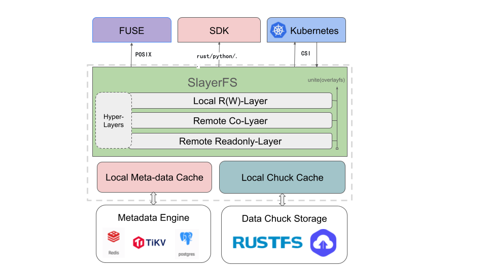

<div align="center">
	
</div>

<h1 align="center">SlayerFS</h1>
<p align="center"><strong>High-performance Rust &amp; Layers-aware Distributed Filesystem</strong></p>
<p align="center"><a href="README.md"><b>English</b></a> | <a href="README_CN.md">中文</a></p>

[](LICENSE)
[](https://www.rust-lang.org/)


## ✨ Project Overview

SlayerFS is a Rust-based distributed filesystem for container and AI scenarios. It uses a chunk/block layout and integrates with object storage backends (LocalFS implemented; S3/Rustfs reserved) to provide path-based read/write, directory operations, truncate, and other basic capabilities, making it easy to integrate with SDKs and FUSE.

Core idea: decouple compute from storage. Applications use POSIX-like interfaces to access data, while the scheduler/cache layers decide where the data lives and how it’s accessed.

## 🖼 Architecture

<div align="center">
	
</div>

Components overview:
- chuck: ChunkLayout, ChunkReader/Writer. Maps file offsets to chunk/block and handles cross-block IO and zero-filling holes.
- cadapter: Object backend abstraction and implementations (LocalFs implemented; S3/Rustfs placeholders).
- meta: In-memory metadata + transactions (InMemoryMetaStore). Tracks size and slice, supports commit/rollback.
- vfs: Path-based simplified VFS (mkdir_p/create/read/write/readdir/stat/unlink/rmdir/rename/truncate).
- sdk: App-facing lightweight client wrapper (with LocalClient convenience).

## 🚀 Quick Start

### Requirements

- Rust: >= 1.75.0
- Operating system: Linux (Ubuntu 20.04+, CentOS 8+)

```bash
cargo run -q --bin sdk_demo -- /tmp/slayerfs-objroot
```
The demo will:
- Create nested directories/files, perform cross-block/chunk writes and read verification
- Do rename, truncate (shrink/extend), readdir and unlink/rmdir
- Print expected error scenarios and finally output "sdk demo: OK"
---

## 🌟 Current Features (MVP)

### Path-based VFS
- mkdir_p/create/read/write/readdir/stat/exists/unlink/rmdir/rename/truncate
- Single mutex to protect the namespace (avoid multi-lock deadlocks); avoid awaiting under lock on hot paths

### Chunked IO with zero-fill
- 64MiB chunk + 4MiB block (default, configurable)
- Write path splits by block; read path returns zeros for holes

### Object-backed BlockStore
- LocalFs implemented (for tests/examples); S3/Rustfs placeholders

### Metadata with txn
- InMemoryMetaStore: alloc_inode, record_slice, update_size (truncate shrink works)
- Transaction commit/rollback tests are in place

More: see `doc/sdk.md` and inline rustdoc.

---

## 📚 Docs
- Design: `doc/arch.md`
- SDK: `doc/sdk.md`

---


## 🤝 Contributing

Issues and PRs are welcome to improve architecture, implementation, and docs.


