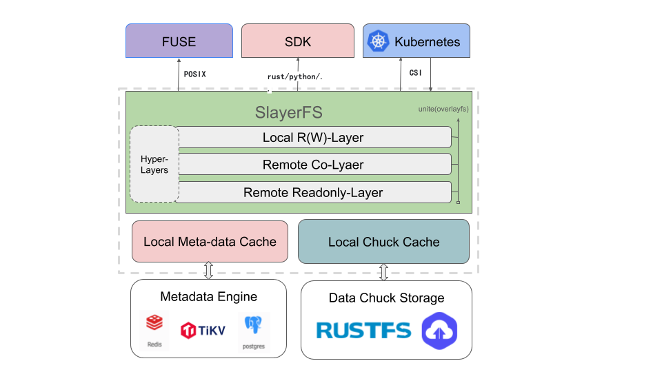

<div align="center">
	
</div>

<h1 align="center">SlayerFS</h1>
<p align="center"><strong>高性能 Rust &amp; 层感知分布式文件系统</strong></p>
<p align="center"><a href="README.md">English</a> | <a href="README_CN.md"><b>中文</b></a></p>

[](LICENSE)
[](https://www.rust-lang.org/)


## ✨ 项目概览

SlayerFS 是一个使用 Rust 构建、面向容器与 AI 场景的分布式文件系统原型（MVP）。它采用 chunk/block 的数据布局，并与对象存储后端对接（LocalFS 已实现；S3/Rustfs 预留），提供基于路径的读写、目录操作、截断等基础能力，便于与 SDK 与 FUSE 集成。

核心理念：计算与存储解耦。应用通过 POSIX 风格接口访问数据，由调度/缓存层决定数据的驻留位置与访问路径。

## 🖼 架构

<div align="center">
	
</div>

组件概览：
- chuck：ChunkLayout、ChunkReader/Writer，负责将文件偏移映射到 chunk/block，处理跨块 IO 与洞零填充；
- cadapter：对象后端抽象与实现（LocalFs 已实现，S3/Rustfs 预留）；
- meta：内存版元数据与事务（InMemoryMetaStore），记录 size 与 slice，支持提交/回滚；
- fs：基于路径的 FileSystem（mkdir/mkdir_all/create/read/write/readdir/stat/unlink/rmdir/rename/truncate）；
- vfs：面向 FUSE 的 inode-based VFS；
- sdk：面向应用的轻量客户端封装（基于 FileSystem，提供 LocalClient 便捷构造）。

## 🚀 快速开始

### 环境要求

- Rust: >= 1.75.0
- 操作系统：Linux (Ubuntu 20.04+, CentOS 8+)

```bash
cargo run -q --bin sdk_demo -- /tmp/slayerfs-objroot
```
示例将会：
- 创建多级目录/文件，进行跨 block/chunk 写入与读回校验；
- 执行重命名、截断（收缩/扩展）、列目录与删除；
- 打印预期错误场景，并输出 "sdk demo: OK"。

---

## 🌟 当前能力（MVP）

### 基于路径的 FileSystem
- mkdir/mkdir_all/create/read/write/readdir/stat/exists/unlink/rmdir/rename/truncate
- 使用单把互斥锁保护命名空间（避免多锁死锁）；热点路径避免持锁 await

### 分块 IO + 洞零填充
- 默认 64MiB chunk + 4MiB block（可配置）
- 写路径按 block 拆分；读路径对未写区域返回 0

### 对象存储 BlockStore
- LocalFs 已实现（用于测试/示例）；S3/Rustfs 预留接口

### 带事务的元数据
- InMemoryMetaStore：alloc_inode、record_slice、update_size（支持截断收缩）
- 已覆盖提交/回滚测试

更多细节：参见 `doc/sdk.md` 与源码注释。

---

## 📚 文档
- 设计：`doc/arch.md`
- SDK 使用：`doc/sdk.md`
- Docker 镜像构建：`doc/docker-image-build.md`

---

## 🐳 Docker 镜像构建

当前维护的容器流程是 `project/slayerfs/docker/Dockerfile` 对应的 SlayerFS 镜像构建。该镜像会包含：
- 当前仓库编译得到的 `slayerfs` 主程序；
- `project/slayerfs/docker/entrypoint.sh` 中的默认启动入口；
- 从 xfstests 预构建压缩包中提取的一个辅助二进制，默认由 `XFSTESTS_BINARY` 控制。

构建前需要先拉取 Dockerfile 依赖的 Git LFS 资源：

```bash
git lfs install --local
git lfs pull --include="project/slayerfs/tests/scripts/xfstests-prebuilt/*.tar.gz"
```

需要在 `rk8s` 仓库根目录执行构建，这样上下文才与 CI 中的配置一致：

```bash
docker build \
	-f project/slayerfs/docker/Dockerfile \
	-t slayerfs:local \
	project
```

当前镜像使用 `rust:1.91-bookworm` 作为 builder、`debian:trixie-slim` 作为 runtime，以匹配当前 lockfile 与预构建 `xfs_io` 的运行时依赖。

如果希望换成预构建包里的其他 xfstests 工具，可以覆盖 `XFSTESTS_BINARY`：

```bash
docker build \
	-f project/slayerfs/docker/Dockerfile \
	--build-arg XFSTESTS_BINARY=xfs_io \
	-t slayerfs:local \
	project
```

镜像默认行为如下：
- 入口会执行 `slayerfs mount`；
- 本地数据后端默认目录为 `/var/lib/slayerfs/data`；
- 元数据后端默认使用 sqlite，路径为 `/var/lib/slayerfs/metadata.db`；
- 提取出的 xfstests 辅助二进制位于 `/opt/xfstests/bin`；
- 镜像声明了 `/mnt/slayerfs` 和 `/var/lib/slayerfs` 两个 volume。

默认 local-fs + sqlite 运行示例：

```bash
docker run --rm \
	--device /dev/fuse \
	--cap-add SYS_ADMIN \
	--security-opt apparmor=unconfined \
	-v slayerfs-state:/var/lib/slayerfs \
	-v slayerfs-mount:/mnt/slayerfs \
	slayerfs:local
```

Redis 元数据后端示例：

```bash
docker run --rm \
	--device /dev/fuse \
	--cap-add SYS_ADMIN \
	--security-opt apparmor=unconfined \
	--network slayerfs_slayerfs-network \
	-e SLAYERFS_META_BACKEND=redis \
	-e SLAYERFS_META_URL=redis://redis:6379 \
	-v slayerfs-data:/var/lib/slayerfs \
	-v slayerfs-mount:/mnt/slayerfs \
	slayerfs:local
```

Etcd 元数据后端示例：

```bash
docker run --rm \
	--device /dev/fuse \
	--cap-add SYS_ADMIN \
	--security-opt apparmor=unconfined \
	--network slayerfs_slayerfs-network \
	-e SLAYERFS_META_BACKEND=etcd \
	-e SLAYERFS_META_ETCD_URLS=http://etcd:2379 \
	-v slayerfs-data:/var/lib/slayerfs \
	-v slayerfs-mount:/mnt/slayerfs \
	slayerfs:local
```

如果没有传入 `/dev/fuse` 和对应权限，容器仍然可以生成配置并初始化元数据后端，但会在 FUSE 挂载阶段失败。

CI 中对应的是 `.github/workflows/slayerfs-docker.yml`。该工作流会在 pull request 和 `main` 分支 push 时构建同一份镜像；只有在配置了 `SLAYERFS_DOCKERHUB_REPOSITORY`、`DOCKERHUB_USERNAME` 和 `DOCKERHUB_TOKEN` 后，才会执行 Docker Hub 发布。


---

## 🤝 参与贡献

欢迎通过 Issue/PR 参与改进架构、实现与文档。
