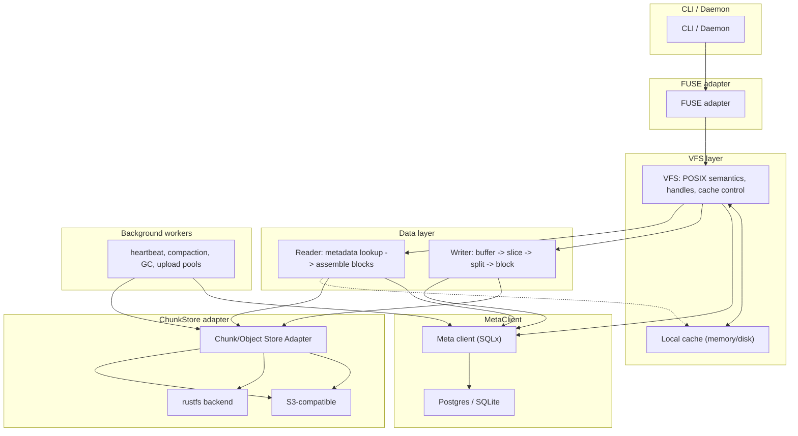

# S3LayerFS


# S3LayerFS

Version: 0.1

Summary
------
This document describes an MVP for a Rust-based distributed filesystem (in the spirit of juicefs-rs) with a persistent backend that interfaces with `rustfs`. The goal is to produce a mountable, usable system as quickly as possible: FUSE mounting, centralized metadata (DB), a write path that goes from write buffer -> slice -> chunk -> block -> upload (to rustfs), a read path that locates blocks via metadata and fills local cache on misses, and simple compaction and GC. The document includes the data model, module partitioning, API examples, and deployment/testing strategies.

MVP feature checklist (must-have)
---------------------------------
- FUSE mount and basic filesystem operations (open/read/write/create/unlink/rename/truncate/stat/readdir)
- Metadata backend: Postgres (production) / SQLite (single-node development)
- Write path: in-memory buffer -> slice -> chunk (64 MiB) -> block (default 4 MiB) -> concurrent upload to rustfs
- Read path: locate blocks via metadata, prefer local cache; on cache miss read from rustfs and fill cache
- Client session registration and heartbeat (used for crash recovery / cleanup)
- Background workers: upload workers, compaction, GC, session cleaner
- CLI tools: `format`, `mount`, `fsck` (basic)

Optional (post-MVP iterations)
- Improved local disk caching policies (LRU, size-limit)
- Support for more metadata backends (TiKV, Redis)
- Encryption/compression plugins, multi-tenancy, finer-grained permissions

Overall architecture (layered)
------------------
- CLI / Daemon (single binary)
- FUSE adapter (fuser / fuse3)
- VFS layer: POSIX semantics, handle management, cache control
- MetaClient: SQLx (Postgres/SQLite) or other backend, responsible for transactions and mappings
- Data layer (Reader / Writer)
	- Writer: buffer -> slice -> split -> block -> upload -> metadata commit
	- Reader: metadata lookup -> assemble blocks -> return data
- ChunkStore adapter: implementation that targets `rustfs` (preferred) or an S3-compatible adapter
- Local cache: disk or memory-backed cache
- Background workers: heartbeat, compaction, GC, upload pools

## Architecture diagram



说明：
- 写路径（绿色实线）：VFS 将写缓冲切片与分块后，通过 Adapter 上传块对象，并向 Meta 提交 blocks/slice_blocks/slices 以及 inode.size 的原子更新。
- 读路径（蓝色虚线）：VFS 先查 Meta 获取块信息，从 Adapter 读取并按需填充本地缓存，再拼装返回。
- 后台任务：心跳、合并压缩（compaction）、GC、并行上传池等与 Meta/Adapter 协作。

Modules communicate primarily using async Tokio; IO and uploads are asynchronous and concurrent.

Metadata model (suggested simplified SQL schema)
-------------------------------------
The following schema is a suggested example suitable for Postgres or SQLite (fields are simplified):

```sql
CREATE TABLE inodes (
	ino BIGINT PRIMARY KEY,
	parent BIGINT,
	name TEXT,
	mode INTEGER,
	uid INTEGER,
	gid INTEGER,
	size BIGINT,
	atime TIMESTAMP,
	mtime TIMESTAMP,
	ctime TIMESTAMP
);

CREATE TABLE chunks (
	chunk_id BIGSERIAL PRIMARY KEY,
	ino BIGINT,
	chunk_index INTEGER,
	updated_at TIMESTAMP
);

CREATE TABLE slices (
	slice_id BIGSERIAL PRIMARY KEY,
	chunk_id BIGINT,
	offset INT,  -- offset within the chunk
	length INT,
	created_at TIMESTAMP,
	status TEXT, -- pending | committed
	owner_session TEXT
);

CREATE TABLE blocks (
	block_id UUID PRIMARY KEY,
	object_key TEXT,
	size INT,
	checksum TEXT,
	refcount INT DEFAULT 0,
	created_at TIMESTAMP
);

CREATE TABLE slice_blocks (
	slice_id BIGINT,
	block_id UUID,
	block_index INT,
	PRIMARY KEY (slice_id, block_index)
);

CREATE TABLE sessions (
	session_id TEXT PRIMARY KEY,
	host TEXT,
	pid INT,
	start_time TIMESTAMP,
	last_heartbeat TIMESTAMP
);
```


